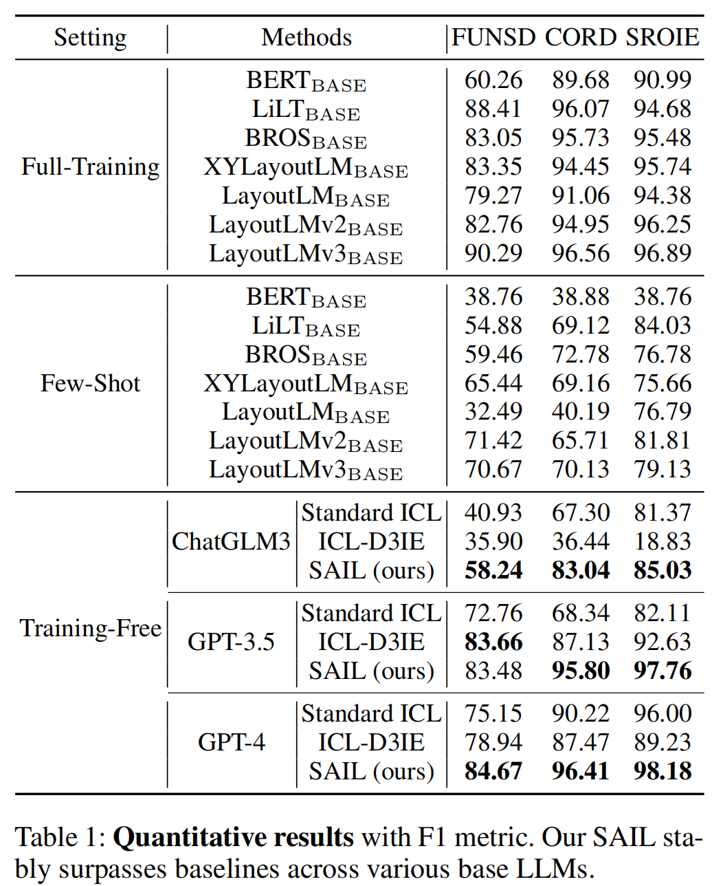

# SAIL: Sample-Centric In-Context Learning for Document Information Extraction

## Table of contents
- [Getting Started](#getting-started)
  - [Installation](#installation)
- [Data Preparation](#data-preparation)
    - [Download datasets](#download-datasets)
    - [Preprocess datasets](#preprocess-datasets)
- [Prepare for predict](#prepare-for-predict)
- [Predict](#predict)
- [Eval](#eval)
- [Results](#results)

We propose SAmple-centric In-context Learning (SAIL), which introduces a fine-grained entity-level textual similarity to facilitate in-depth text analysis by LLMs and incorporates layout similarity to enhance the analysis of layouts in VRDs. Moreover, SAIL formulates a unified In-Context Learning (ICL) prompt template for various sample-centric examples, enabling tailored prompts that deliver precise guidance to pre-trained models for each sample.


## Getting Started
### Installation
Installation for Project
```git clone https://github.com/SAIL.git```

### Experimental environment
The following is the environment used in our experiments.
```
Python 3.11.4
openai 1.14.2
tiktoken 0.5.2
seqeval 1.2.2
scikit-learn 1.4.1.post1
sentence-transformers 2.6.0
numpy 1.26.3
pillow 10.2.0
torch 2.1.2
```

## Data Preparation
### Download datasets
| Datasets | Download Link |
| :---: | :---: |
|FUNSD| [download](https://www.kaggle.com/datasets/aravindram11/funsdform-understanding-noisy-scanned-documents) |
|CORD| [download](https://github.com/clovaai/cord)|
|SROIE| [download](https://www.kaggle.com/datasets/urbikn/sroie-datasetv2)|

The file names in the FUNSD and CORD datasets are named with serial numbers like '0.json' and '1.json'. 

### Preprocess datasets
Preprocess the datasets to the json format.
```
cd dataset_process
```

**FUNSD:** 
Use this command to convert the original data set into json format:
```
python preprocess_funsd.py
```
Use this command to 
adaptively crop the images:
```
python preprocess_funsd_cut.py
```

**CORD:** 
Use this command to convert the original data set into json format:
```
python preprocess_cord.py
```
Use this command to adaptively crop the images:
```
python preprocess_cord_cut.py
```

**SROIE:** 
Use this command to convert the original data set into json format(include adaptively cropping):
```
python preprocess_sroie.py
```

To generate ground truth files, please change the line
`res_words += ('{' + 'text:"{}",Box:[{}]'.format(text, box) + '}')`
to
`res_words+=('{'+'text:"{}",Box:[{}],entity:{}'.format(text,box,label)+'}')`


## Prepare for predict
Generate the needed files for the predict method.
- Generate document and entity text information: 
```
cd preprocess
python textprocess.py
```
- Generate layout image information: 
```
python imageprocess.py
```
Taking the CORD dataset as an example, the following files should be generated:
```
processfiles
├── ptext_cord_train.txt
├── ptext_cord_test.txt
├── pentitytext_cord_train.txt

CORD
├── test
│   ├── layoutimage
│   │   ├── 0.jpg
│   │   ├── 1.jpg
│   │   └── ...
├── train
│   ├── layoutimage
│   │   ├── 0.jpg
│   │   ├── 1.jpg
│   │   └── ...
```

## Predict
You can run the following command to predict the results of the FUNSD, CORD and SROIE datasets.
```
cd method
python {}test.py
```
For example, to predict the results of the CORD dataset, you can run the following command:
```
cd method
python cordtest.py
```

## Eval
For FUNSD and CORD, you can run the following command to evaluate the results.
```
cd eval
python eval_{}.py
```
For SROIE dataset, you should process the predict results first, and then eval the processed results.
```
cd dataset_process
python postjson.py
python postprocess_sroie.py
```

## Results


## BibTex
If you find our work useful for your research and applications, please cite using the BibTeX:
```
@inproceedings{SAIL
  title={SAIL: Sample-Centric In-Context Learning for Document Information Extraction},
  author={Zhang, Jinyu and You, Zhiyuan and Wang, Jize and Le, Xinyi},
  booktitle={Proceedings of the AAAI Conference on Artificial Intelligence},
  year={2025}
```


